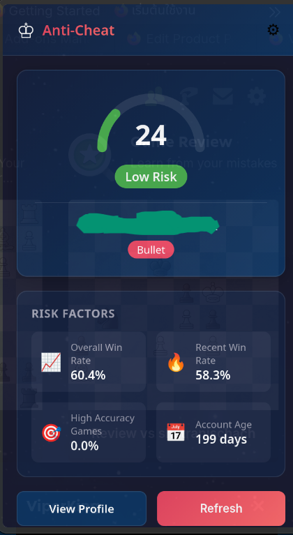
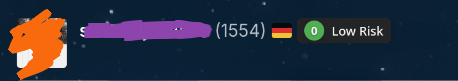

# 🛡️ Chess.com Opponent Risk Score - Firefox Extension

<div align="center">


**A Firefox extension that helps detect potential cheaters on Chess.com by analyzing player statistics and displaying real-time risk scores.**

*Inspired by the [Chrome extension](https://github.com/tim-sha256/chess.com-anti-cheat) by Tim Sh*

</div>

---

## ✨ Features

- **🎯 Real-time Risk Analysis** - Automatically detects opponents and calculates risk scores
- **📊 In-Page Risk Badge** - Clean, non-intrusive badge displayed next to opponent's username
- **🎮 All Game Formats** - Supports Bullet, Blitz, and Rapid time controls
- **📈 Multi-Factor Analysis** - Considers win rates, accuracy, and account age
- **🌙 Dark Mode Support** - Seamlessly integrates with Chess.com's dark theme
- **⚙️ Configurable Thresholds** - Customize risk level boundaries via options page
- **📱 SPA Navigation Support** - Works across Chess.com's single-page app navigation

## 📸 Screenshots

The extension displays a color-coded risk badge directly on the game page:

<div align="center">



*Real-time risk badge displayed next to opponent's username*



*Detailed statistics popup with risk breakdown*

</div>

| Risk Level | Score Range | Color |
|------------|-------------|-------|
| 🟢 Low Risk | 0 - 30 | Green |
| 🟡 Moderate Risk | 31 - 50 | Yellow |
| 🟠 High Risk | 51 - 70 | Orange |
| 🔴 Very High Risk | 71 - 100 | Red |

## 🔧 Installation

### From Source (Developer Mode)

1. **Clone or download this repository**
   ```bash
   git clone https://github.com/yourusername/chess-anti-cheat-firefox.git
   cd chess-anti-cheat-firefox
   ```

2. **Load in Firefox**
   - Open Firefox and navigate to `about:debugging`
   - Click "This Firefox" in the sidebar
   - Click "Load Temporary Add-on..."
   - Select the `manifest.json` file from the extension folder

3. **Navigate to Chess.com** and start a game!

### Permanent Installation

For permanent installation, the extension needs to be signed by Mozilla. See [Mozilla's documentation](https://extensionworkshop.com/documentation/publish/signing-and-distribution-overview/) for more details.

## 🧠 How It Works

The extension uses Chess.com's public API to analyze opponents by gathering:

### Data Sources
- **Win/Loss/Draw Statistics** - Overall and recent game performance
- **Game Accuracy** - Percentage of high-accuracy games (potential engine use indicator)
- **Account Age** - Newer accounts with suspicious stats receive higher risk scores
- **Rating Progression** - Across different time controls

### Risk Calculation

The risk score is calculated using a weighted formula:

```
Risk Score = Account Age Factor × (
    0.35 × Overall Win Rate Score +
    0.35 × Recent Win Rate Score +
    0.30 × High Accuracy Score
)
```

**Recent accounts (< 60 days) receive a 1.5x multiplier** on their final score.

### Scoring Breakdown

| Component | Weight | Description |
|-----------|--------|-------------|
| Overall Win Rate | 35% | Win rate across all rated games |
| Recent Win Rate | 35% | Win rate in the last games |
| High Accuracy Games | 30% | Percentage of games with suspiciously high accuracy |

## 🔬 Technical Details

- **Manifest Version 2** - Maximum Firefox compatibility (v57+)
- **Vanilla JavaScript** - No build step required
- **Real-time DOM Monitoring** - MutationObserver for game detection
- **Debounced Updates** - Efficient performance with state management
- **Message Passing** - Content script ↔ Background communication

### Architecture

```
chess-anti-cheat-firefox/
├── manifest.json          # Extension manifest
├── background/
│   └── background.js      # API calls & risk calculation
├── content/
│   ├── content.js         # DOM monitoring & badge display
│   └── content.css        # Badge styling
├── popup/
│   ├── popup.html         # Browser action popup
│   └── popup.js           # Popup logic
├── options/
│   ├── options.html       # Settings page
│   └── options.js         # Settings logic
├── src/
│   ├── config.js          # Thresholds & constants
│   ├── utils.js           # API utilities
│   ├── metrics.js         # Data processing
│   └── risk-score.js      # Risk calculation algorithm
└── icons/                 # Extension icons
```

## ⚙️ Configuration

Customize the extension behavior via the **Options page** (right-click extension icon → "Manage Extension" → "Options"):

| Setting | Default | Description |
|---------|---------|-------------|
| `RATED_ONLY` | `true` | Only consider rated games for risk score |
| `AUTO_OPEN_POPUP` | `true` | Automatically open popup when opponent detected |
| `SHOW_IN_PAGE_BADGE` | `true` | Display risk badge on the game page |
| `HIGH_RISK_THRESHOLD` | `70` | Score threshold for high risk warning |
| `MODERATE_RISK_THRESHOLD` | `50` | Score threshold for moderate risk |

### Advanced Configuration

For developers, thresholds can be adjusted in `src/config.js`:

```javascript
const THRESHOLDS = {
    ACCOUNT_AGE_DAYS: 60,        // Days to consider account "new"
    ACCOUNT_AGE_MULTIPLIER: 1.5, // Risk multiplier for new accounts
    MIN_GAMES: 5,                // Minimum games for analysis
    WEIGHTING_K: 20              // Sample size weighting constant
};
```

## 🚫 Important Disclaimer

> **⚠️ This extension provides statistical analysis only. A high risk score does NOT guarantee that a player is cheating.**

The risk score is based on publicly available statistics and should be used as one factor among many when evaluating opponents. Many legitimate players may have high win rates or accuracy due to:

- Being significantly underrated
- Playing against weaker opposition
- Natural talent and dedication
- Playing openings they've extensively studied

**Always respect Chess.com's fair play policies and avoid false accusations.**

## 🤝 Contributing

Contributions are welcome! Please feel free to submit a Pull Request.

1. Fork the repository
2. Create your feature branch (`git checkout -b feature/AmazingFeature`)
3. Commit your changes (`git commit -m 'Add some AmazingFeature'`)
4. Push to the branch (`git push origin feature/AmazingFeature`)
5. Open a Pull Request

## 📝 License

This project is licensed under the MIT License - see the [LICENSE](LICENSE) file for details.

## 🙏 Acknowledgments

- Original Chrome extension concept by [Tim Sh](https://github.com/tim-sha256/chess.com-anti-cheat)
- [Chess.com Public API](https://www.chess.com/news/view/published-data-api) for player statistics
- The chess community for feedback and testing

---

<div align="center">

**Made with ♟️ for fair play in chess**

</div>
